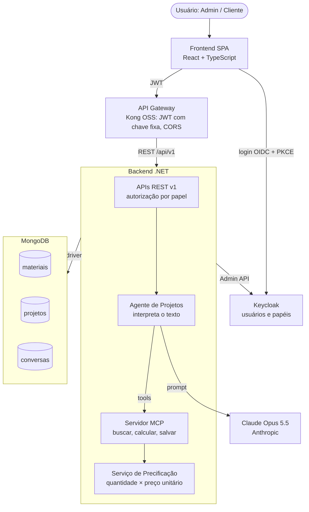
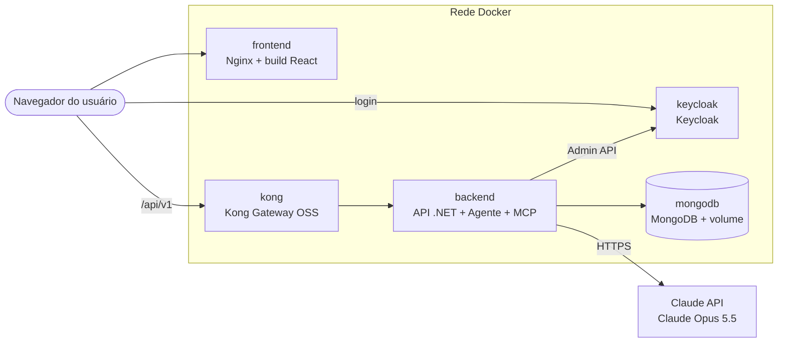
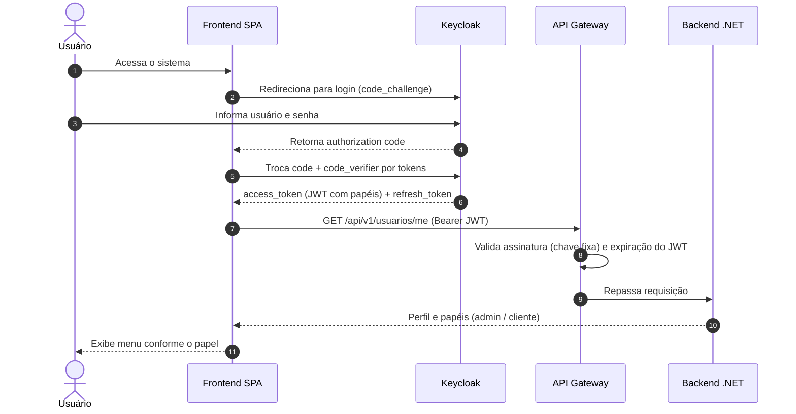
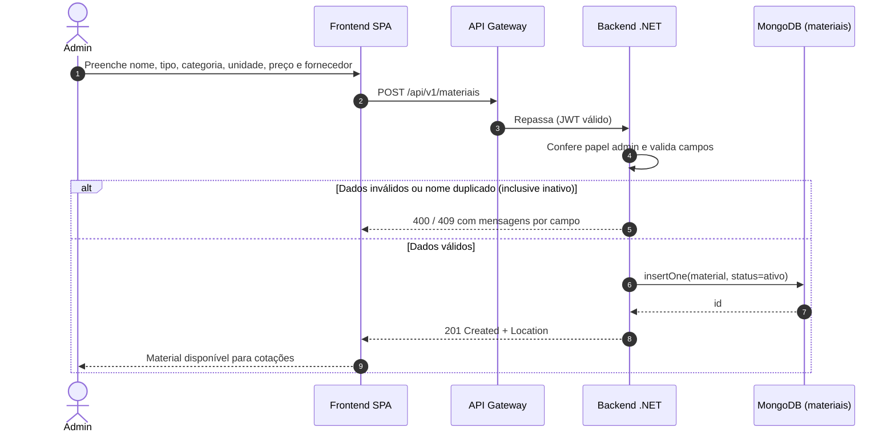
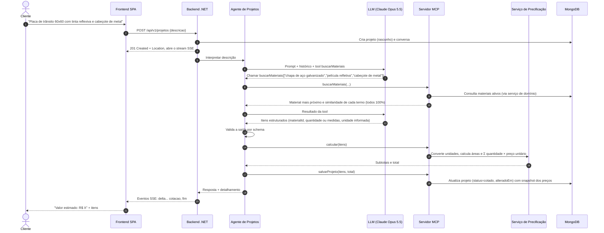
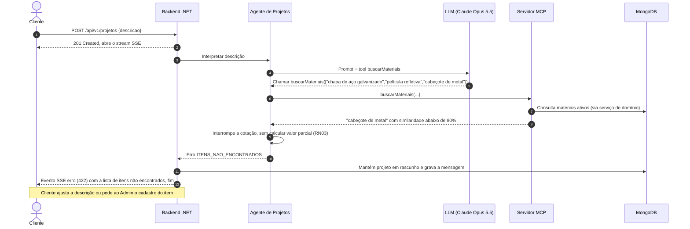
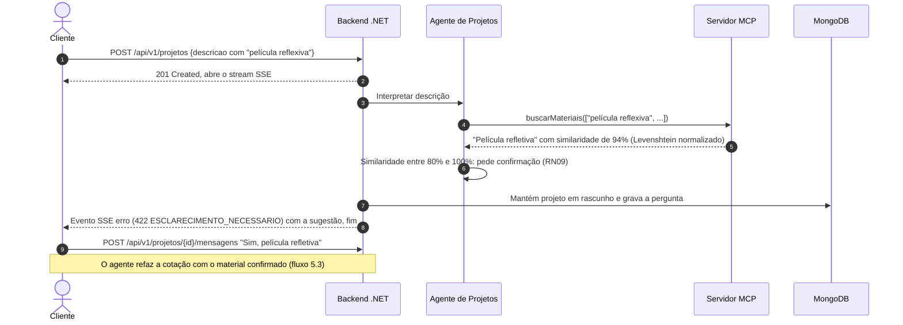

# Arquitetura e decisões (ADRs)

> Sistema de Cotação de Projetos · versão 0.7 · 04/10/2026
> Visão de alto nível, atributos de qualidade e registro das decisões de arquitetura.

## 1. Visão geral

O sistema tem três camadas (React SPA → .NET → MongoDB). Um agente de IA interpreta a descrição do projeto e busca materiais por uma tool MCP; o valor sai sempre do Serviço de Precificação, e o Keycloak é a única fonte de usuários.

| Camada | Componente | Responsabilidade |
| --- | --- | --- |
| Apresentação | Frontend SPA | Telas de catálogo e chat de cotação; login OIDC |
| Borda | API Gateway (Kong OSS) | Roteamento, validação de JWT com a chave pública do realm (ADR-010), CORS |
| Identidade | Keycloak | Usuários, papéis, emissão de tokens |
| Aplicação | Backend .NET | APIs REST, regras de negócio, autorização por papel |
| Aplicação | Agente de Projetos | Orquestra o diálogo, chama as tools, monta a resposta ou o erro (itens não encontrados, esclarecimento) |
| Aplicação | Serviço de Precificação | Cálculo determinístico, conversão de unidades, cálculo de área e congelamento dos preços na cotação |
| Integração | Servidor MCP | Tools `buscarMateriais`, `calcular`, `salvarProjeto` |
| Externo | LLM: Anthropic Claude Opus 5.5 | Interpretação de linguagem natural e chamada da tool `buscarMateriais` |
| Dados | MongoDB | Coleções `materiais`, `projetos`, `conversas` |

Versões e bibliotecas: ver `tech-stack.md`.

### 1.1 Visão de implantação

Cada camada roda no seu próprio contêiner Docker, todos na mesma rede; localmente, o conjunto sobe com `docker compose up` (ADR-009), usando **HTTP**. Só o Frontend, o Kong e o login do Keycloak ficam expostos ao usuário; Backend, MongoDB e a API administrativa do Keycloak são acessados apenas pela rede interna. Neste momento só existe o ambiente local.

| Contêiner | Camada | Imagem | Exposto ao usuário |
| --- | --- | --- | --- |
| `frontend` | Apresentação | Própria (Nginx) | Sim |
| `kong` | Borda | Oficial | Sim |
| `keycloak` | Identidade | Oficial | Sim, para login |
| `backend` | Aplicação | Própria (.NET) | Não |
| `mongodb` | Dados | Oficial, com script de inicialização | Não |

## 2. Atributos de qualidade (requisitos não funcionais)

| ID | Categoria | Requisito |
| --- | --- | --- |
| RNF01 | Segurança | JWT validado no Gateway e no Backend; HTTPS obrigatório fora do ambiente local (o ambiente local usa HTTP); segredos em `.env` no ambiente local e no AWS KMS fora dele |
| RNF02 | Desempenho | CRUD de materiais em até 500 ms (p95); primeira parte da resposta da cotação em até 3 s via streaming |
| RNF04 | Manutenibilidade | Cobertura de testes unitários ≥ 70% no Backend; API documentada em OpenAPI |
| RNF05 | Usabilidade | Interface responsiva em português; acessibilidade WCAG 2.1 AA |

O RNF03 (disponibilidade) foi retirado do MVP.

## 3. Índice de ADRs

| ADR | Decisão | Status | Origem na revisão |
| --- | --- | --- | --- |
| ADR-001 | Preço calculado por serviço determinístico, não pelo LLM | Aceita | Ponto 1 |
| ADR-002 | Item fora do catálogo retorna erro; sem busca na internet | Aceita | Ponto 2 |
| ADR-003 | MongoDB como base única, com documentos embutidos | Aceita | Ponto 3 |
| ADR-004 | Keycloak como única fonte de identidade (OIDC + PKCE) | Aceita | Pontos 4, 5 e 9 |
| ADR-005 | API REST orientada a recursos e versionada | Aceita | Ponto 6 |
| ADR-006 | Servidor MCP único para todas as tools do agente | Aceita | Ponto 7 |
| ADR-007 | Cotação congelada na emissão (snapshot de preços) | Aceita | Ponto 8 |
| ADR-008 | LLM: Anthropic Claude Opus 5.5 | Aceita | — |
| ADR-009 | Um contêiner Docker por camada | Aceita | — |
| ADR-010 | Kong valida o JWT com a chave pública fixa do realm | Aceita | Dúvida D7 do plano |

---

### ADR-001 — Preço calculado por serviço determinístico, não pelo LLM

- **Status:** Aceita · 04/10/2026
- **Contexto:** o diagrama original mostrava o LLM retornando o valor do projeto. LLMs erram aritmética e podem dar respostas diferentes para a mesma entrada, o que torna o preço não auditável.
- **Decisão:** o agente usa o LLM só para interpretar a descrição e extrair itens, quantidades, medidas e unidades informadas em saída estruturada. O **Serviço de Precificação** (.NET) converte unidades, calcula áreas a partir das medidas (RN05) e calcula `quantidade × preço unitário` e o total.
- **Consequências:** valor reproduzível e testável; o Backend precisa validar a saída do LLM por schema; é necessária uma tabela fixa de conversão de unidades.

### ADR-002 — Item fora do catálogo retorna erro; sem busca na internet

- **Status:** Aceita · 04/10/2026 (substitui a proposta de busca web da v0.1)
- **Contexto:** o requisito original previa buscar preços na internet quando o material não existisse na base. Isso traria preços de fontes não controladas, custo de mais um provedor e um fluxo de aprovação.
- **Decisão:** não há busca externa. A correspondência entre termo e material segue a similaridade da RN09. Se qualquer item da descrição ficar abaixo de 80% de similaridade, a cotação **não é calculada** e o agente retorna `422` com `code = ITENS_NAO_ENCONTRADOS` e a lista dos itens. Entre 80% e menos de 100%, o agente pede confirmação ao cliente (`422 ESCLARECIMENTO_NECESSARIO`).
- **Consequências:** preços sempre controlados pelo Admin; a qualidade da cotação depende de um catálogo completo; o projeto fica em `rascunho` até o cliente ajustar a descrição ou o Admin cadastrar o item.

### ADR-003 — MongoDB como base única, com documentos embutidos

- **Status:** Aceita · 04/10/2026
- **Contexto:** o diagrama nomeava banco só para materiais e deixava a camada de dados incompleta. O requisito pede NoSQL.
- **Decisão:** um cluster MongoDB com as coleções `materiais`, `projetos` (com itens embutidos) e `conversas` (com mensagens embutidas). Usuários não são persistidos no MongoDB.
- **Consequências:** leitura da cotação em uma consulta; valores em `Decimal128`. Índices:
    - `materiais.nome` único, com *collation* `pt` de força 1, que ignora maiúsculas e acentos e vale também para inativos (RN10).
    - `projetos.clienteId`.
    - `conversas.projetoId` único.

### ADR-004 — Keycloak como única fonte de identidade

- **Status:** Aceita · 04/10/2026
- **Contexto:** o diagrama tinha CRUD de usuário próprio além do Keycloak, e o Frontend não se autenticava.
- **Decisão:** o Frontend faz login no Keycloak por OIDC Authorization Code + PKCE. Gateway e Backend validam o JWT. Os papéis `admin`, `cliente-interno` e `cliente-externo` são *realm roles* do Keycloak. Não há autocadastro: os usuários são criados pelo Admin. A API `/usuarios` apenas repassa para a Keycloak Admin API.
- **Consequências:** uma só fonte de senhas e papéis; o Backend referencia o usuário por `keycloakId`.

### ADR-005 — API REST orientada a recursos e versionada

- **Status:** Aceita · 04/10/2026
- **Contexto:** rotas como `POST /CriarMaterial` misturam verbo e recurso.
- **Decisão:** recursos no plural com versão no caminho (`/api/v1/materiais`), verbos HTTP para a ação e erros em Problem Details. As respostas do agente (cotação e refinamento) usam SSE com eventos em JSON. Padrões detalhados em `standards.md`.
- **Consequências:** contrato previsível e documentável em OpenAPI; mudanças incompatíveis exigem `/api/v2`.

### ADR-006 — Servidor MCP único para todas as tools do agente

- **Status:** Aceita · 04/10/2026
- **Contexto:** o MCP aparecia só na tool de materiais.
- **Decisão:** um Servidor MCP expõe `buscarMateriais`, `calcular` e `salvarProjeto`. As tools chamam os serviços de domínio, nunca o banco direto. O LLM recebe **apenas** `buscarMateriais`; `calcular` e `salvarProjeto` são chamadas **somente pelo código do agente**, depois que a saída estruturada do LLM é validada.
- **Consequências:** regras de negócio e autorização aplicadas também nas chamadas do agente; tools testáveis isoladamente; o LLM não tem como disparar cálculo nem gravação.

### ADR-007 — Cotação congelada na emissão

- **Status:** Aceita · 04/10/2026
- **Contexto:** as entidades não se relacionavam; se o item apontasse só para o material, mudar o preço no catálogo mudaria cotações já emitidas.
- **Decisão:** cada item do projeto guarda `materialId` e uma cópia do nome e do preço unitário na data em que entrou na cotação (`nomeSnapshot`, `precoUnitarioSnapshot`). Esses campos nunca são recalculados a partir do catálogo. No refinamento, o cliente pode alterar quantidades e incluir, remover ou trocar materiais; só não pode alterar preço (RN02).
- **Consequências:**
    - O preço unitário de um item já cotado é imutável.
    - Item incluído ou trocado usa o preço atual do catálogo, que fica congelado a partir daí.
    - O refinamento recalcula só os itens alterados, refaz o total e atualiza `alteradoEm`.
    - O catálogo pode mudar livremente.

### ADR-008 — LLM: Anthropic Claude Opus 5.5

- **Status:** Aceita · 04/10/2026
- **Contexto:** o Agente de Projetos precisa interpretar descrições em linguagem natural, chamar as tools do Servidor MCP e devolver itens e quantidades em saída estruturada.
- **Decisão:** usar o **Claude Opus 5.5**, da Anthropic, pela Claude API, com o identificador de modelo `claude-opus-5-5`. A integração usa o SDK oficial para C# (pacote `Anthropic`), exposto como `IChatClient` do `Microsoft.Extensions.AI`, o que permite usar diretamente as tools do SDK C# do MCP.
- **Consequências:**
    - Suporte nativo a tool use e saída estruturada, base do ADR-001.
    - Janela de contexto de 1M tokens, suficiente para o histórico de conversa de um projeto.
    - A chave da Claude API é tratada como segredo e injetada por variável de ambiente.
    - Trocar de modelo no futuro fica restrito à configuração do `IChatClient`, sem mudar o domínio.
    - Nos testes, o `IChatClient` é substituído por um *mock* com respostas fixas (`standards.md` §7).
- **Fontes:** [Visão geral dos modelos](https://platform.claude.com/docs/en/models/overview) · [SDK C#](https://platform.claude.com/docs/en/cli-sdks-libraries/sdks/csharp)

### ADR-009 — Um contêiner Docker por camada

- **Status:** Aceita · 04/10/2026
- **Contexto:** o sistema tem três camadas próprias (Frontend, Backend, banco) e dois componentes de terceiros (Keycloak, Kong). É preciso que todos rodem da mesma forma em qualquer ambiente.
- **Decisão:** cada camada roda no seu próprio contêiner Docker: `frontend` (Nginx servindo o build do React), `backend` (API .NET com agente, MCP e precificação) e `mongodb`. Keycloak e Kong usam as imagens oficiais. O ambiente local é orquestrado com Docker Compose. Padrões em `standards.md`; imagens e versões em `tech-stack.md`.
- **Consequências:**
    - Ambiente igual em qualquer máquina, com uma imagem versionada por release.
    - Cada camada pode ser atualizada ou escalada sem mexer nas outras.
    - No MVP não há pipeline de CI nem registro de imagens: as imagens são geradas com `docker compose build` e ficam no Docker instalado na máquina.
    - O MongoDB depende de volume persistente e de rotina de backup fora do contêiner.

### ADR-010 — Kong valida o JWT com a chave pública fixa do realm

- **Status:** Aceita · 04/10/2026
- **Contexto:** o Kong OSS 3.9 é a última linha com imagens OSS. O plugin `jwt` da edição OSS não busca a chave no endpoint JWKS do Keycloak, e o plugin OpenID Connect só existe na edição Enterprise.
- **Decisão:** o Kong valida o JWT com o plugin `jwt` (RS256, `claims_to_verify=exp`). Um consumidor tem `key` igual ao `iss` do realm e a chave pública do realm, configurada no `kong.yml`. A chave do realm é fixa e a rotação é manual.
- **Consequências:** nenhuma imagem customizada nem plugin de terceiros; rotacionar a chave exige atualizar o realm e o `kong.yml` juntos; o Backend continua validando o JWT pelos metadados do Keycloak.

---

## 4. Catálogo da API (v1)

| Método | Rota | Perfil | Descrição |
| --- | --- | --- | --- |
| GET | /api/v1/materiais?busca=&categoria=&status=&pagina=&tamanho= | Admin, Cliente interno | Lista paginada (tela do catálogo) |
| GET | /api/v1/materiais/{id} | Admin, Cliente interno | Detalhe |
| POST | /api/v1/materiais | Admin | Cria material |
| PUT | /api/v1/materiais/{id} | Admin | Altera ou reativa material (não afeta cotações emitidas) |
| DELETE | /api/v1/materiais/{id} | Admin | Inativa (exclusão lógica) |
| POST | /api/v1/projetos | Cliente, Admin | Cria projeto a partir da descrição; resposta em SSE com a cotação ou o erro (`422` de itens não encontrados ou de esclarecimento, `500` de falha) |
| GET | /api/v1/projetos | Cliente (próprios), Admin (todos) | Lista projetos |
| GET | /api/v1/projetos/{id} | Dono, Admin | Detalhe com itens |
| DELETE | /api/v1/projetos/{id} | Dono, Admin | Arquiva projeto |
| POST | /api/v1/projetos/{id}/mensagens | Dono | Mensagem de refinamento (quantidades e inclusão, remoção ou troca de materiais; nunca preço); resposta em SSE; `422` se o projeto estiver arquivado |
| GET | /api/v1/projetos/{id}/mensagens | Dono, Admin | Histórico da conversa |
| GET | /api/v1/usuarios/me | Todos | Perfil e papéis do usuário logado |
| GET, POST, PUT, DELETE | /api/v1/usuarios[/{id}] | Admin | Repasse à Keycloak Admin API |

Não existe `PUT /api/v1/projetos/{id}`: o projeto só é alterado pela conversa com o agente (RN02).

Correspondência com as rotas do diagrama original: `POST /CriarMaterial` → `POST /api/v1/materiais`; `GET /CapturarMaterial` → `GET /api/v1/materiais`; o mesmo vale para Projeto e Usuário.

## 5. Diagramas de sequência

### 5.1 Login (OIDC Authorization Code + PKCE)

### 5.2 Admin cadastra material

### 5.3 Cliente solicita cotação (fluxo principal)

### 5.4 Material não encontrado: cotação retorna erro

### 5.5 Material com similaridade incerta: confirmação

