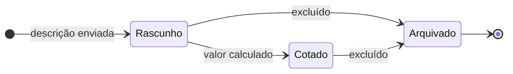
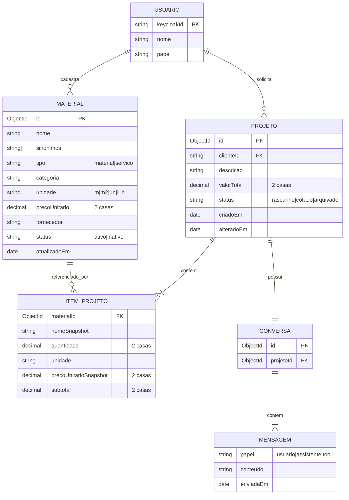

# Regras de negócio e domínio

> Sistema de Cotação de Projetos · versão 0.9 · 04/10/2026
> O que o sistema faz, para quem, e com quais regras. Referência para PO, desenvolvedores e testes de aceite.

## 1. Propósito

O cliente descreve um projeto em linguagem natural e recebe o valor estimado em reais, calculado a partir dos materiais e serviços cadastrados no catálogo. O sistema é genérico: atende projetos de qualquer ramo (por exemplo têxtil, sinalização, gráfica ou construção), bastando cadastrar os materiais correspondentes.

> **Exemplo** — Entrada: *"Quero cotar uma placa de trânsito com tinta reflexiva de 60 x 60 cm com cabeçote de metal."* Saída: *"Para esse projeto o valor estimado é R$ X"*, com a lista de itens.

## 2. Glossário

| Termo | Definição |
| --- | --- |
| Material | Insumo ou serviço com preço unitário no catálogo (ex.: faixa reflexiva, tecido, tinta, impressão, auditoria) |
| Catálogo | Conjunto de materiais com status `ativo` |
| Projeto | Pedido de cotação de um cliente, com descrição, itens e valor total |
| Item do projeto | Material usado no projeto, com quantidade, unidade e preço congelado |
| Cotação | Valor estimado de um projeto, com a lista de itens e o preço unitário de cada item congelado na data em que o item entrou na cotação |
| Item não encontrado | Item da descrição sem material correspondente no catálogo ativo (similaridade abaixo de 80% e sem sugestão do agente); impede o cálculo da cotação |
| Similaridade | Grau de semelhança, de 0% a 100%, entre o termo da descrição e o nome ou um sinônimo de um material do catálogo (RN09) |
| Sinônimo | Outro nome pelo qual o cliente pode chamar um material (ex.: "placa" para "Chapa de aço galvanizado"), cadastrado pelo Admin |
| Sugestão do agente | Material que o LLM propõe, pelo sentido, para um termo sem correspondência; só é usado se o cliente confirmar (RN09) |
| Conversa | Histórico de mensagens entre cliente e agente de um projeto |

## 3. Perfis e permissões

| Ação | Admin | Cliente interno | Cliente externo |
| --- | --- | --- | --- |
| Cadastrar, alterar, inativar e reativar materiais (tela de cadastro) | Sim | Não | Não |
| Consultar a tela do catálogo de materiais | Sim | Sim (somente leitura) | Não |
| Ver os dados dos materiais na tela de cotação (itens e sugestões) | Sim | Sim | Sim |
| Solicitar e refinar cotações | Sim | Sim | Sim |
| Ver projetos | Todos | Os próprios | Os próprios |
| Gerenciar usuários e papéis | Sim | Não | Não |

Os usuários são cadastrados pelo Admin. Não há autocadastro. Só o Admin altera a base de materiais. Os clientes veem os dados dos materiais apenas na tela de cotação e não incluem, alteram nem removem materiais da base.

## 4. Requisitos funcionais

| ID | Requisito | Perfil | Prioridade |
| --- | --- | --- | --- |
| RF01 | Autenticar via Keycloak (OIDC) e encerrar sessão | Todos | Must |
| RF02 | Cadastrar, alterar, consultar, inativar e reativar materiais e serviços (nome, sinônimos, tipo, categoria, unidade, preço unitário, fornecedor) | Admin | Must |
| RF03 | Descrever um projeto em linguagem natural e receber o valor estimado com a lista de itens | Cliente, Admin | Must |
| RF04 | Refinar a cotação em conversa ("troque para 80x80", "inclua parafusos", "tire o cabeçote"), alterando quantidades e incluindo, removendo ou trocando materiais, e mantendo o histórico | Cliente, Admin | Must |
| RF05 | Retornar erro com a lista de itens não encontrados no catálogo, sem calcular valor parcial | Sistema | Must |
| RF06 | Manter o preço unitário de cotações emitidas inalterado quando o preço de um material mudar | Sistema | Must |
| RF07 | Listar, abrir e excluir projetos salvos | Cliente, Admin | Should |
| RF08 | Pedir esclarecimento quando faltar medida ou quantidade, ou para confirmar o material quando a similaridade não for exata ou quando o material for uma sugestão do agente | Sistema | Should |
| RF09 | Exportar a cotação em PDF | Cliente | Fora do MVP |
| RF10 | Gerenciar usuários e papéis pela aplicação | Admin | Could |

## 5. Regras de negócio

- **RN01 — Cálculo.** Valor do item = quantidade × preço unitário; valor do projeto = soma dos itens. A cotação considera **apenas o custo dos materiais** do catálogo: não inclui margem de lucro nem impostos. O cálculo é feito pelo Serviço de Precificação, nunca pelo LLM.
- **RN02 — Cotação congelada.** Quando um item entra na cotação, ele guarda uma cópia do nome e do preço unitário do material naquela data. O preço unitário de um item já cotado **nunca muda**.
    - No refinamento, sempre pela conversa com o agente, o cliente pode alterar quantidades e incluir, remover ou trocar materiais. A **única** coisa proibida é alterar o preço de um material.
    - Item incluído, ou material trocado, usa o preço atual do catálogo, que fica congelado a partir daí. A correspondência do novo material segue a RN09.
    - Só os itens alterados, incluídos ou trocados são recalculados. Os demais mantêm o subtotal gravado, e o total é refeito como soma dos subtotais.
    - Enquanto o projeto está em `rascunho`, o cliente pode reformular a descrição e confirmar materiais pela conversa.
    - Alterar ou inativar o material no catálogo não muda cotações já emitidas.
- **RN03 — Item não encontrado.** Se qualquer item da descrição não tiver material correspondente no catálogo ativo (RN09), a cotação não é calculada e o sistema retorna erro listando os itens não encontrados. Não há busca de preços fora da base. Se houver ao mesmo tempo itens não encontrados e itens a confirmar, o erro de itens não encontrados prevalece.
- **RN04 — Exclusão lógica.** Material excluído é inativado para preservar o histórico e pode ser reativado pelo Admin. Projeto excluído é arquivado.
- **RN05 — Unidades e medidas.** O LLM extrai as medidas e a unidade informada pelo cliente (ex.: 60 x 60 cm). O Serviço de Precificação converte para a unidade do material e calcula a área quando a unidade for `m2`, seguindo a tabela fixa abaixo.

| Unidade do material | Unidades aceitas na descrição | Conversão |
| --- | --- | --- |
| `m` | mm, cm, m | 1 mm = 0,001 m · 1 cm = 0,01 m |
| `m2` | mm², cm², m², ou duas medidas lineares (largura × altura) | 1 cm² = 0,0001 m² · 1 mm² = 0,000001 m² · área = largura (m) × altura (m) |
| `L` | ml, L | 1 ml = 0,001 L |
| `h` | min, h | 1 min = 1/60 h |
| `un` | un | Sem conversão |

Com largura × altura, uma quantidade informada é o número de peças: "2 placas de 60 x 60 cm" = 2 × 0,36 m² = 0,72 m². Uma medida que não converte para a unidade do material (ex.: ml para m²), uma medida faltando ou uma quantidade que zera ao arredondar retornam `422` com `code = MEDIDA_INVALIDA`.

- **RN06 — Esclarecimento.** Se faltar medida ou quantidade necessária ao cálculo, o agente pergunta antes de calcular. A resposta é um erro `422` com `code = ESCLARECIMENTO_NECESSARIO` e a pergunta.
- **RN07 — Visibilidade.** Cliente só acessa os próprios projetos; Admin acessa todos.
- **RN08 — Precisão e arredondamento.**
    - **Gravação e exibição:** todos os valores gravados na base e exibidos ao usuário (quantidade, preço unitário, subtotal e total) têm **2 casas decimais**.
    - **Cálculo:** usa **3 casas decimais**. Um resultado intermediário com mais de 3 casas (por exemplo, uma quantidade convertida, uma área ou um produto) é primeiro arredondado para 3 casas pelo arredondamento comum (4ª casa ≥ 5 sobe).
    - **De 3 para 2 casas:** olha a 3ª casa decimal. Se ela for **maior que 5 (6 a 9), arredonda para cima**; se for **5 ou menor, arredonda para baixo**. A mesma regra vale para valores em reais e para quantidades.
    - **Quantidade:** é levada a 2 casas **antes** da multiplicação, pela mesma regra. Assim o cálculo usa exatamente a quantidade exibida, e o cliente consegue refazer a conta de cada item com o que vê na tela.
    - **Subtotal:** quantidade (2 casas) × preço unitário (2 casas), levado a 3 casas e depois a 2. O total é a soma dos subtotais arredondados.

| Valor calculado | Valor com 3 casas | Valor gravado e exibido | Motivo |
| --- | --- | --- | --- |
| 43,206 | 43,206 | R$ 43,21 | 3ª casa = 6, sobe |
| 43,209 | 43,209 | R$ 43,21 | 3ª casa = 9, sobe |
| 43,205 | 43,205 | R$ 43,20 | 3ª casa = 5, desce |
| 43,201 | 43,201 | R$ 43,20 | 3ª casa = 1, desce |
| Subtotal: 0,35 × R$ 27,35 = 9,5725 | 9,573 | R$ 9,57 | 4ª casa = 5, vira 9,573; depois 3ª casa = 3, desce |
| Quantidade: 10 min em h = 0,16666… | 0,167 h | 0,17 h | 4ª casa = 6, vira 0,167; depois 3ª casa = 7, sobe |
| Subtotal: 0,17 h × R$ 85,00 = 14,45 | 14,450 | R$ 14,45 | O cálculo usa a quantidade exibida (0,17 h) |
| Área: 33 cm × 33 cm = 0,1089 m² | 0,109 m² | 0,11 m² | 4ª casa = 9, vira 0,109; depois 3ª casa = 9, sobe |

- **RN09 — Correspondência com o catálogo.** A correspondência entre o termo da descrição e o material é feita em dois passos.
    - **Passo 1 — Similaridade (determinístico).** O Backend compara cada termo com o **nome e com cada sinônimo** de cada material ativo, pela **distância de Levenshtein normalizada**:
        - Os textos são normalizados antes: minúsculas, sem acentos e com espaços extras removidos.
        - Similaridade = 1 − (distância de Levenshtein ÷ tamanho do maior dos dois textos).
        - Vale o maior resultado entre o nome e os sinônimos, e o material de maior similaridade.
    - **Passo 2 — Sugestão do agente.** Só para os termos que ficaram abaixo de 80% no passo 1. O LLM recebe a lista de materiais ativos e pode sugerir **um** material com o mesmo sentido do termo. A sugestão nunca é usada direto: sempre vira uma pergunta de confirmação ao cliente. Se o LLM não sugerir nada, o termo é um item não encontrado.

| Resultado | O que acontece |
| --- | --- |
| Passo 1 com 100% | O material é usado na cotação |
| Passo 1 de 80% a menos de 100% (incerteza de até 20%) | O agente pergunta se o material mais próximo é o correto: erro `422` com `code = ESCLARECIMENTO_NECESSARIO` e as sugestões (`origem = similaridade`) |
| Passo 1 abaixo de 80%, com sugestão do agente | O agente pergunta se o material sugerido é o correto: erro `422` com `code = ESCLARECIMENTO_NECESSARIO` e as sugestões (`origem = agente`) |
| Passo 1 abaixo de 80%, sem sugestão do agente | Item não encontrado (RN03) |

Um material que o cliente confirma na conversa passa a valer como correspondência de 100% para aquele termo, naquele projeto. No passo 2, o LLM não define preço nem quantidade e só pode sugerir materiais da lista recebida.

- **RN10 — Cadastro de material.** Nome, tipo (`material` ou `servico`), categoria (texto livre), unidade, preço unitário e fornecedor são obrigatórios. Sinônimos são opcionais. O preço unitário tem **2 casas decimais**. O nome é único no catálogo inteiro, incluindo materiais inativos, sem diferenciar maiúsculas e acentos. Um sinônimo não pode repetir o nome nem o sinônimo de outro material, com a mesma comparação; se repetir, o cadastro retorna `409`.
- **RN11 — Projeto arquivado.** Projeto arquivado é somente leitura. Qualquer tentativa de alterá-lo ou de enviar mensagem retorna `422` com `code = PROJETO_ARQUIVADO` e a mensagem "Este projeto está inativo."
- **RN12 — Falha no processamento.** Se o agente ou o LLM falhar, o sistema retorna `500` com `code = FALHA_PROCESSAMENTO` e a mensagem "Não foi possível processar essa mensagem no momento, favor contate o administrador". O projeto continua no estado anterior.

## 6. Ciclo de vida do projeto

Um projeto passa por três estados. O diagrama mostra só as mudanças de estado; as situações em que o projeto permanece no mesmo estado estão na tabela abaixo dele.



| Estado | Entra quando | Permanece quando | Sai para |
| --- | --- | --- | --- |
| Rascunho | O cliente envia a descrição | Há item não encontrado (RN03), falta medida ou quantidade (RN06), há material a confirmar (RN09) ou ocorre falha (RN12) | Cotado, ao calcular o valor; Arquivado, se excluído |
| Cotado | Todos os itens são encontrados e o valor é calculado | O cliente refina a cotação (quantidades, inclusão, remoção ou troca de materiais); o preço dos itens já cotados não muda (RN02). Se o refinamento cair em RN03, RN06, RN09 ou RN12, a cotação anterior é mantida | Arquivado, se excluído |
| Arquivado | O cliente ou o Admin exclui o projeto | Sempre: somente leitura (RN11) | Estado final |

## 7. Modelo de domínio



No MongoDB, `ITEM_PROJETO` fica embutido no documento do projeto e `MENSAGEM` embutida na conversa; `USUARIO` vive no Keycloak e é referenciado pelo `keycloakId`. Os campos `nomeSnapshot` e `precoUnitarioSnapshot` são gravados quando o item entra na cotação e nunca recalculados a partir do catálogo (RN02). Todos os valores decimais são gravados com 2 casas (RN08). `criadoEm` registra a criação do projeto e `alteradoEm` a última alteração (cotação, refinamento ou arquivamento).

## 8. Exemplos de resultado

A cotação e o refinamento respondem em **SSE** (`text/event-stream`), e o campo `data` de cada evento é JSON (padrões em `standards.md` §5). Os valores abaixo são fictícios e servem só para ilustrar o formato.

Cotação calculada (evento `cotacao`):

```json
{
  "id": "6703f1c2a9",
  "status": "cotado",
  "criadoEm": "2026-10-04T14:30:00-03:00",
  "alteradoEm": "2026-10-04T14:30:00-03:00",
  "itens": [
    { "nome": "Chapa de aço galvanizado", "quantidade": 0.36, "unidade": "m2", "precoUnitario": 120.00, "subtotal": 43.20 },
    { "nome": "Película refletiva", "quantidade": 0.36, "unidade": "m2", "precoUnitario": 95.00, "subtotal": 34.20 },
    { "nome": "Cabeçote de metal", "quantidade": 1, "unidade": "un", "precoUnitario": 28.50, "subtotal": 28.50 }
  ],
  "valorTotal": 105.90,
  "moeda": "BRL"
}
```

Item fora do catálogo (evento `erro`):

```json
{
  "type": "https://precificacao/erros/itens-nao-encontrados",
  "title": "Itens não encontrados no catálogo",
  "status": 422,
  "code": "ITENS_NAO_ENCONTRADOS",
  "itensNaoEncontrados": ["cabeçote de metal"],
  "projetoId": "6703f1c2a9"
}
```

Material a confirmar ou medida faltando (evento `erro`):

```json
{
  "type": "https://precificacao/erros/esclarecimento-necessario",
  "title": "Esclarecimento necessário",
  "status": 422,
  "code": "ESCLARECIMENTO_NECESSARIO",
  "pergunta": "Você quis dizer \"Película refletiva\" para \"película reflexiva\" e \"Suporte em L de aço\" para \"cantoneira\"?",
  "sugestoes": [
    { "termo": "película reflexiva", "materialId": "6703e0aa01", "nome": "Película refletiva", "origem": "similaridade", "similaridade": 0.94 },
    { "termo": "cantoneira", "materialId": "6703e0aa07", "nome": "Suporte em L de aço", "origem": "agente", "similaridade": null }
  ],
  "projetoId": "6703f1c2a9"
}
```

Projeto arquivado (resposta HTTP `422` direta, pois é verificado antes de abrir o stream):

```json
{ "status": 422, "code": "PROJETO_ARQUIVADO", "title": "Este projeto está inativo." }
```

Falha de processamento (evento `erro`):

```json
{ "status": 500, "code": "FALHA_PROCESSAMENTO", "title": "Não foi possível processar essa mensagem no momento, favor contate o administrador" }
```

## 9. Decisões de negócio

| Questão | Decisão (04/10/2026) |
| --- | --- |
| A cotação inclui margem de lucro e impostos? | Não. Apenas o custo dos materiais (RN01) |
| Precisão dos valores | Gravados e exibidos com 2 casas; cálculo com 3 casas; a quantidade entra no cálculo já com 2 casas, igual à exibida (RN08) |
| Regra de arredondamento de 3 para 2 casas | 3ª casa maior que 5 arredonda para cima; 5 ou menor, para baixo. Vale para reais e quantidades (RN08) |
| Valor com mais de 3 casas | Arredondamento comum para 3 casas antes da regra da 3ª casa (RN08) |
| Prazo de retenção do histórico de conversas | Não aplicado; fora do escopo deste projeto |
| Quem calcula área e conversão de unidades | O Serviço de Precificação; o LLM só extrai medidas e unidades (RN05) |
| O que o refinamento pode alterar | Quantidades e inclusão, remoção ou troca de materiais, só pela conversa com o agente. Nunca o preço de um material (RN02) |
| Como associar termo e material | Levenshtein normalizado sobre nome e sinônimos: 100% usa, de 80% a menos de 100% confirma; abaixo de 80%, o agente pode sugerir um material, sempre com confirmação do cliente; sem sugestão, não encontrado (RN09) |
| O que o cliente vê dos materiais | Os dados dos materiais na tela de cotação; não acessa a tela de cadastro nem altera a base (§3) |
| Resposta quando falta medida ou há material a confirmar | `422 ESCLARECIMENTO_NECESSARIO` (RN06, RN09) |
| Cadastro de material | Tipo, categoria livre, fornecedor obrigatório, preço com 2 casas, nome único incluindo inativos, reativação permitida (RN10) |
| Projeto arquivado | Somente leitura; `422` "Este projeto está inativo." (RN11) |
| Falha do agente ou do LLM | `500` com mensagem fixa (RN12) |
| Admin pode cotar? | Sim |
| Autocadastro de clientes | Não; usuários são criados pelo Admin |
| Exportação em PDF (RF09) | Fora do MVP |
