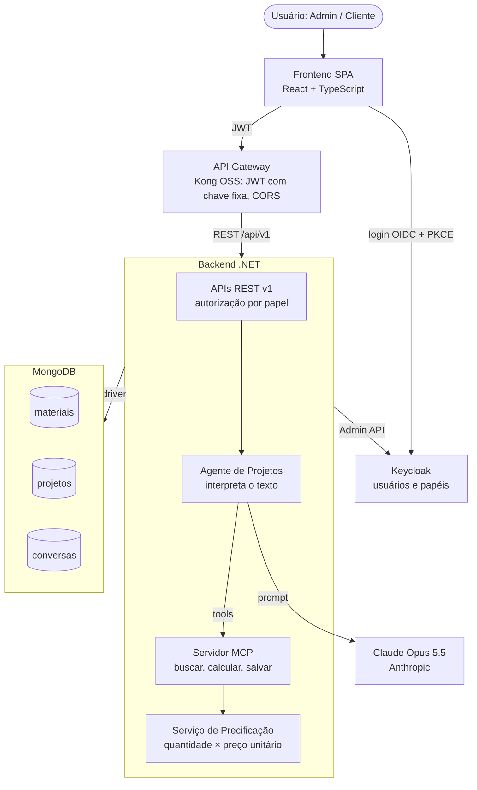
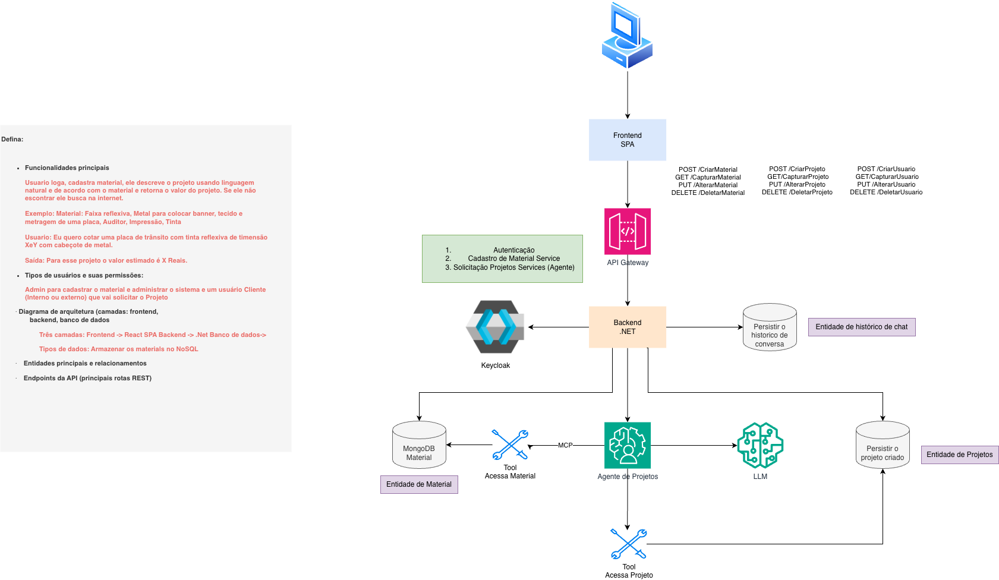

# ProjectPricingAI — Sistema de Cotação de Projetos

Projeto desenvolvido para o trabalho do **MBA em Engenharia de Software** na disciplina
**Engenharia de Software 2.0** (abordagem *AI-Driven Development*). O objetivo do laboratório
foi **definir a arquitetura de um MVP** e, em seguida, **implementá-lo a partir de arquivos de
contexto, usando agentes de IA**.

## Sobre o projeto

O **Sistema de Cotação de Projetos** permite que um cliente descreva um projeto em **linguagem
natural** e receba o **valor estimado em reais**, calculado a partir dos materiais e serviços
cadastrados em um catálogo. O sistema é **genérico**: atende projetos de qualquer ramo (têxtil,
sinalização, gráfica, construção, etc.), bastando cadastrar os materiais correspondentes.

> **Exemplo** — Entrada: *"Quero cotar uma placa de trânsito com tinta reflexiva de 60 x 60 cm
> com cabeçote de metal."* → Saída: *"Para esse projeto o valor estimado é R$ X"*, com a lista
> de itens.

Um **agente de IA** interpreta a descrição e identifica os materiais; o **cálculo é sempre
determinístico** (feito por um Serviço de Precificação em .NET, nunca pelo LLM), o que torna o
valor reproduzível e auditável.

### Principais funcionalidades

- Autenticação via Keycloak (OIDC + PKCE) com três papéis.
- Cadastro, alteração, inativação e reativação de materiais e serviços (Admin).
- Cotação de projetos em linguagem natural, com resposta em *streaming* (SSE).
- Refinamento da cotação por conversa (trocar medidas, incluir/remover/trocar materiais).
- Correspondência de termos com o catálogo por similaridade (Levenshtein normalizado) e
  sugestão do agente com confirmação do cliente.
- Cotação **congelada** na emissão: mudanças de preço no catálogo não afetam cotações já feitas.
- Listagem, abertura e exclusão lógica (arquivamento) de projetos.

### Tipos de usuário e permissões

| Ação | Admin | Cliente interno | Cliente externo |
| --- | --- | --- | --- |
| Gerenciar materiais (cadastro/alteração/inativação) | Sim | Não | Não |
| Consultar a tela de catálogo | Sim | Sim (leitura) | Não |
| Solicitar e refinar cotações | Sim | Sim | Sim |
| Ver projetos | Todos | Os próprios | Os próprios |
| Gerenciar usuários e papéis | Sim | Não | Não |

## Arquitetura

Três camadas (React SPA → .NET → MongoDB), com Keycloak como fonte única de identidade,
Kong como API Gateway e um agente de IA (Claude Opus 5.5) que acessa as ferramentas via MCP.



A documentação completa de arquitetura, regras de negócio, padrões e stack está na pasta
[`.ai/`](.ai/) (os arquivos de contexto usados pelos agentes de IA):

- [`.ai/architecture.md`](.ai/architecture.md) — decisões de alto nível (ADRs), diagramas de
  arquitetura e de sequência, catálogo da API.
- [`.ai/business-rules.md`](.ai/business-rules.md) — lógica de negócio, domínio, regras de
  cálculo e ciclo de vida do projeto.
- [`.ai/standards.md`](.ai/standards.md) — convenções de código e estilo (SOLID, Clean Code,
  padrões de API, testes).
- [`.ai/tech-stack.md`](.ai/tech-stack.md) — versões e bibliotecas permitidas.

Documentação complementar em [`docs/`](docs/): [guia de uso](docs/guia-de-uso.md),
[guia de debug](docs/guia-de-debug.md) e [plano de execução](docs/plano-de-execucao.md).

## Stack tecnológica

| Camada | Tecnologia |
| --- | --- |
| Frontend | React 19 + TypeScript (Vite), servido por Nginx |
| Backend | .NET 10 (ASP.NET Core) |
| Banco de dados | MongoDB 8.0 |
| Identidade | Keycloak 26 (OIDC + PKCE) |
| API Gateway | Kong Gateway OSS 3.9 |
| LLM | Anthropic Claude Opus 5.5 (via Claude API) |
| Ferramentas do agente | Model Context Protocol (SDK C#) |
| Orquestração local | Docker + Docker Compose |

## Prompts utilizados (entregáveis do laboratório)

Os prompts que originaram este projeto estão versionados em
[`docs/prompts/`](docs/prompts/). Ambas as etapas foram conduzidas no **Claude** (chat para a
arquitetura e Claude Code — agente de IA na IDE — para a implementação).

- **[`docs/prompts/AgenteArquiteto.md`](docs/prompts/AgenteArquiteto.md)** — conversa de
  **criação da arquitetura** e **geração de contexto** (Aula 1). Partiu do diagrama inicial
  desenhado para o trabalho ([`Projeto-AI-Eng-MBA.png`](docs/prompts/Projeto-AI-Eng-MBA.png)) e
  produziu a documentação do sistema, depois separada nos arquivos de contexto `standards.md`,
  `architecture.md`, `tech-stack.md` e `business-rules.md`. Inclui também os ajustes finos de
  refinamento.
- **[`docs/prompts/AgenteImplantacao.md`](docs/prompts/AgenteImplantacao.md)** — conversa de
  **implementação** (Aula 2), executada pelo agente de IA a partir dos arquivos de contexto da
  pasta `.ai/`, gerando o plano de execução e o código do MVP. Inclui as rodadas de decisão
  (dúvidas D1–D25 e Q1–Q11) usadas para validar e refinar o resultado.

> Esses arquivos preservam os prompts solicitados no trabalho (criação da arquitetura, geração de
> contexto e implementação) e os ajustes finos, indicando a ferramenta utilizada em cada etapa.



## Como executar localmente

Pré-requisitos: **Docker** e **Docker Compose** instalados. O ambiente local roda em HTTP.

1. Copie o arquivo de exemplo de variáveis de ambiente e preencha os valores:

   ```bash
   cp .env.example .env
   ```

2. Gere a chave RSA do realm (grava a chave privada no `.env` e a pública no `kong.yml`):

   ```bash
   ./scripts/gerar-chave-realm.sh
   ```

3. Preencha a `ANTHROPIC_API_KEY` no `.env` (necessária para a cotação com o agente).

4. Suba todos os contêineres:

   ```bash
   docker compose up -d
   ```

5. (Opcional) Carregue o catálogo de materiais de referência:

   ```bash
   ./scripts/carregar-catalogo-referencia.sh
   ```

### Portas e endereços

| Serviço | Endereço |
| --- | --- |
| Frontend (SPA) | http://localhost:3000 |
| API via Kong (Gateway) | http://localhost:8000 |
| Contrato OpenAPI | http://localhost:8000/openapi/v1.json |
| Keycloak (login/console) | http://localhost:8080 |

> O backend e o MongoDB ficam apenas na rede interna do Docker, sem exposição ao usuário.

## Estrutura do repositório

```
.
├── .ai/            # Arquivos de contexto para os agentes de IA (arquitetura, regras, padrões, stack)
├── backend/        # API .NET 10 (Api, Aplicacao, Dominio, Infraestrutura) + prompts do agente
├── frontend/       # SPA React + TypeScript (Vite)
├── infra/          # Configuração de Keycloak, Kong e inicialização do MongoDB
├── scripts/        # Backup/restauração, chave do realm, catálogo e verificação
├── docs/           # Guias, plano de execução e prompts utilizados
└── docker-compose.yml
```

## Testes e verificação

```bash
./scripts/verificar.sh   # verificação completa antes de publicar
```

Os testes do backend são **unitários** (xUnit + Moq), com cobertura mínima de 70%; o frontend
usa Vitest + Testing Library. Nenhum teste acessa banco real ou chama a Claude API — o LLM é
substituído por um *mock* com respostas fixas.

## Entregáveis do trabalho

- Documento com a arquitetura definida — pasta [`.ai/`](.ai/).
- Repositório no GitHub com a implementação e o diretório de arquivos de contexto —
  <https://github.com/rafaelgils/ProjectPricingAI>.
- Prompt de geração de contexto e prompt de implementação —
  [`docs/prompts/`](docs/prompts/).
- Link do vídeo de demonstração —
  <https://drive.google.com/file/d/10gK2wJo6kpYTPA7bzKq5gAHP8cc-u5yJ/view?usp=sharing>.
