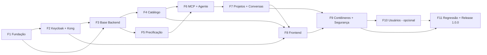

# Plano de execução — Sistema de Cotação de Projetos

> Versão 0.4 · 04/10/2026
> Baseado em `.ai/architecture.md`, `.ai/business-rules.md`, `.ai/standards.md` e `.ai/tech-stack.md` (todos na v0.8, já com as respostas das dúvidas D1 a D25 e dos pontos Q1 a Q11).
> O desenvolvimento é feito por IA. Por isso o plano não traz equipe nem datas: cada fase vira um ou mais Pull Requests, revisados e aprovados por uma pessoa.
> Quando a documentação não define um ponto, o plano adota uma **premissa (P#)**. Os pontos que ainda dependem de resposta estão na seção 8 (**Q#**).

---

## 1. Objetivo e escopo

Entregar a **release 1.0.0 (MVP)** rodando localmente com `docker compose up`, em HTTP.

| Prioridade | Requisitos | Situação no plano |
| --- | --- | --- |
| Must | RF01 a RF06 | Dentro do MVP |
| Should | RF07, RF08 | Dentro do MVP |
| Could | RF10 (gestão de usuários) | Fase opcional F10 |
| Fora do MVP | RF09 (PDF) | Não será feito |

**Valem para todas as fases:**
- RN01 a RN12.
- RNF01, RNF02, RNF04 e RNF05 (o RNF03 foi retirado).
- ADR-001 a ADR-010.

**Fora do escopo neste momento:**
- Pipeline de CI.
- Ambientes de homologação e produção.
- HTTPS no ambiente local.
- Limite de uso da Claude API.

## 2. Premissas adotadas

| ID | Premissa | Motivo |
| --- | --- | --- |
| P1 | O Backend é uma solução .NET com 4 projetos (`Dominio`, `Aplicacao`, `Infraestrutura`, `Api`), mais 1 projeto de testes para cada um | SOLID e inversão de dependência (`standards.md` §2) |
| P2 | O Servidor MCP roda dentro do contêiner `backend` (`ModelContextProtocol.AspNetCore`), no endpoint interno `/mcp`, que o Kong não roteia e que exige token com a policy `PodeCotar`. As três tools são uma única implementação (`IFerramentasCotacao`): o MCP a expõe, e o agente a executa dentro do mesmo processo, na requisição do usuário. *Revisada na F6:* a versão anterior previa o agente chamando o próprio `/mcp` pela rede com o JWT, mas nesse caminho as exceções de domínio chegariam como erro genérico de tool | ADR-006 e ADR-009 |
| P3 | Valores monetários e quantidades usam `decimal` / `Decimal128`. As datas são gravadas em UTC e a API as devolve em `-03:00` | `standards.md` §3 e §5 |
| P4 | Paginação: `tamanho` tem padrão 20 e máximo 100 | `standards.md` §5 não define os valores |
| P5 | A configuração do Frontend é lida na subida do contêiner (`env.js` gerado pelo Nginx), e não no build do Vite | Uma imagem por release (ADR-009) |
| P6 | O SSE é lido no Frontend com `fetch` e leitura de stream, porque o `EventSource` não envia o cabeçalho `Authorization` | `tech-stack.md` §4 |
| P7 | Portas locais: Frontend `http://localhost:3000`, Kong `http://localhost:8000` e Keycloak `http://localhost:8080`. Backend e MongoDB não publicam portas | Arquitetura §1.1 |
| P8 | Chave fixa do realm (ADR-010): o par RSA é gerado por um script com `openssl`. A chave privada fica no `.env` e entra no realm por *placeholder* na importação. A chave pública, que não é segredo, fica versionada no `kong.yml` | Nenhum segredo no Git nem na imagem |
| P9 | A similaridade da RN09 (Levenshtein normalizado) é calculada em memória sobre os materiais ativos, sem índice de busca no MongoDB | Volume de catálogo pequeno no MVP |
| P10 | O prompt de sistema orienta o LLM a usar, como termo de busca, as palavras do próprio cliente para cada item | A RN09 compara o termo com o nome e os sinônimos do material; trocas de sentido ficam para o passo 2, sempre com confirmação |

## 3. Estrutura do repositório

```text
ProjectPricingAI/
├── .ai/                          # regras (v0.6)
├── docs/                         # este plano e guias de usuário
├── .editorconfig
├── docker-compose.yml
├── .env.example                  # todas as variáveis, sem valores secretos
├── scripts/
│   ├── gerar-chave-realm.sh      # par RSA da chave fixa (P8)
│   └── verificar.sh              # build, lint, testes, cobertura e análise de dependências
├── infra/
│   ├── keycloak/realm-precificacao.json
│   ├── kong/kong.yml
│   └── mongodb/init/01-colecoes-indices.js
├── backend/
│   ├── Dockerfile                # multi-stage: sdk:10.0 → aspnet:10.0
│   ├── ProjectPricing.sln
│   ├── src/
│   │   ├── ProjectPricing.Dominio/
│   │   ├── ProjectPricing.Aplicacao/
│   │   ├── ProjectPricing.Infraestrutura/
│   │   └── ProjectPricing.Api/
│   ├── prompts/                  # prompt de sistema e schema de saída versionados
│   └── tests/
│       ├── ...Dominio.Tests / ...Aplicacao.Tests / ...Infraestrutura.Tests / ...Api.Tests
│       └── Regressao/            # 30 descrições + catálogo de referência + respostas fixas do mock
└── frontend/
    ├── Dockerfile                # multi-stage: node LTS → nginx estável
    ├── nginx/default.conf
    └── src/
```

**Sem CI:** o script `scripts/verificar.sh` reúne as verificações que a DoD (`standards.md` §9) exige antes de cada PR:
- `dotnet build` com avisos como erro.
- `dotnet test` com cobertura de 70% ou mais.
- `dotnet list package --vulnerable`.
- `npm run lint`, Prettier, `vitest` e `npm audit`.
- `docker compose build`.

## 4. Fases e entregas

Cada fase termina em PRs `feature/<id>-<descricao>`, com *squash merge*, Conventional Commits e a Definition of Done.

### F1 — Fundação do repositório

1. Criar a estrutura da seção 3, o `.editorconfig`, o `.gitignore` (inclui `.env`) e o `.env.example`.
2. Criar a solução .NET 10 com `Nullable` habilitado, analisadores ativos e `TreatWarningsAsErrors`.
3. Criar o projeto Vite + React 19 + TypeScript 5 `strict`, com ESLint e Prettier.
4. Criar o `scripts/verificar.sh`.
5. Criar o `docker-compose.yml` com os 5 serviços:
   - Imagens com tag fixa, nunca `latest`.
   - *Healthchecks* e `depends_on` com `condition: service_healthy`.
   - Volume nomeado para o MongoDB.
   - Portas como em P7.

6. Instalar as ferramentas de teste e build aprovadas no `tech-stack.md` §4 e §5: `coverlet.collector`, `@vitest/coverage-v8`, `jsdom`, `@testing-library/jest-dom`, `@testing-library/user-event`, `@vitejs/plugin-react` e `typescript-eslint`.

**Critério de aceite:** `docker compose up` sobe os 5 contêineres saudáveis e o `verificar.sh` passa.

**Situação:** concluída em 04/10/2026, na branch `feature/3-fundacao`. Os 5 contêineres ficaram saudáveis e o `verificar.sh` passou, incluindo o `docker compose build`.

### F2 — Identidade (Keycloak) e borda (Kong)

**Keycloak 26.x** em `start-dev` (HTTP), com o realm `precificacao` importado por `--import-realm`:

- *Realm roles*: `admin`, `cliente-interno` e `cliente-externo`.
- Sem autocadastro (`registrationAllowed=false`).
- Cliente `precificacao-frontend`: público, PKCE S256, redirect para `http://localhost:3000/*`.
- Cliente `precificacao-api`: *audience mapper* que inclui `aud=precificacao-api` no token.
- Cliente `precificacao-admin`: confidencial, com *service account* e os papéis `view-users` e `manage-users`. É usado pelo Backend para a Admin API.
- Provedor de chave RSA fixo (P8).
- Um usuário de teste por papel, só no ambiente local.
- `KC_HOSTNAME=http://localhost:8080` com `KC_HOSTNAME_BACKCHANNEL_DYNAMIC=true`. Sem essa opção, os metadados lidos pela rede interna apontariam o `jwks_uri` para `localhost`, que dentro do contêiner `backend` é o próprio contêiner.
- O Backend lê os metadados por `http://keycloak:8080` (`MetadataAddress`), valida o `iss` público e usa `RequireHttpsMetadata=false`, só no ambiente local.

**Kong 3.9 OSS** sem banco (`kong.yml`):

- Serviço `backend` e rota `/api/v1` com `strip_path=false`.
- Plugin `cors` liberando só `http://localhost:3000`.
- Plugin `jwt` com RS256 e `claims_to_verify=exp`. O consumidor tem `key` igual ao `iss` e `rsa_public_key` igual à chave fixa (ADR-010).
- Para o SSE:
  - `response_buffering=false` na rota `/api/v1` inteira, e não em rotas separadas para `POST /projetos` e `POST /projetos/{id}/mensagens`.
    - Uma rota só evita depender da prioridade entre rotas de expressão regular e de prefixo no roteador do Kong.
    - O buffer só seria necessário para plugins que alteram o corpo da resposta, e nenhum é usado.
  - `read_timeout` de 120 s no serviço `backend`. No Kong, o *timeout* é configurado no serviço, não na rota.
- Rota `/openapi/v1.json`, sem JWT.

**Critério de aceite:**
- O login PKCE devolve um token com `realm_access.roles`.
- Uma chamada sem token ao Kong recebe `401`.
- Uma chamada com token chega ao Backend.

**Situação:** concluída em 04/10/2026, na branch `feature/4-identidade-borda`.
- Login PKCE testado com os 3 usuários de teste: os tokens trazem `iss` público, `aud=precificacao-api` e o papel em `realm_access.roles`, e a troca sem `code_verifier` é recusada.
- O Kong devolve `401` sem token e também com assinatura alterada, payload forjado, `alg: none` ou issuer desconhecido.
- Com token válido, a chamada chega ao Backend.
- A chave publicada pelo realm é a mesma do `kong.yml`, e a service account `precificacao-admin` acessa a Admin API.

### F3 — Fundação do Backend

- `Api`:
  - `JwtBearer` com *policies* `PodeGerenciarCatalogo` (admin), `PodeConsultarCatalogo` (admin e cliente-interno), `PodeCotar` (os 3 papéis) e `PodeGerenciarUsuarios` (admin).
  - Nomes dos papéis centralizados numa classe de constantes.
  - `IUsuarioAtual`, que lê o `keycloakId` da claim `sub`.
  - Tratamento global de erros: Problem Details com `code` (`standards.md` §5).
  - OpenAPI nativo em `/openapi/v1.json`.
  - *Healthcheck*.
- `Dominio`:
  - Entidades `Material`, `Projeto` (com `criadoEm` e `alteradoEm`), `ItemProjeto`, `Conversa` e `Mensagem`.
  - Exceções de domínio, cada uma ligada a um `code`:

| Exceção | Status e `code` |
| --- | --- |
| `MaterialDuplicadoException` | 409 |
| `ItensNaoEncontradosException` | 422 `ITENS_NAO_ENCONTRADOS` |
| `EsclarecimentoNecessarioException` | 422 `ESCLARECIMENTO_NECESSARIO` |
| `ProjetoArquivadoException` | 422 `PROJETO_ARQUIVADO`, "Este projeto está inativo." |
| `FalhaProcessamentoException` | 500 `FALHA_PROCESSAMENTO`, com a mensagem fixa da RN12 |
| `RecursoNaoEncontradoException` | 404 |

- `Infraestrutura`:
  - MongoDB.Driver 3.x, com `decimal` serializado como `Decimal128`.
  - Repositórios `IMaterialRepository`, `IProjetoRepository` e `IConversaRepository`.
- MongoDB (`01-colecoes-indices.js`):
  - Coleções com validador `$jsonSchema`.
  - `materiais.nome` único com *collation* `{ locale: "pt", strength: 1 }`.
  - Índice em `projetos.clienteId` e índice único em `conversas.projetoId`.
- `GET /api/v1/usuarios/me`.

**Critério de aceite:** `/usuarios/me` responde através do Kong, e os testes das *policies* e do mapeamento de exceções passam.

**Situação:** concluída em 04/10/2026, na branch `feature/5-base-backend`.
- `/api/v1/usuarios/me` responde pelo Kong para os 3 usuários de teste, cada um com o seu papel.
- O backend também recusa um token válido do realm sem `aud=precificacao-api`, com `401 NAO_AUTENTICADO`.
- Os validadores do MongoDB aceitam o formato gravado pelo backend e recusam preço em `double`, unidade inválida e campo obrigatório ausente.
- Há 94 testes unitários. Toda resposta de erro tem `code`; a tabela de códigos está em `standards.md` §5.
- Decisões de implementação:
  - As entidades são lidas do MongoDB pelo construtor privado, nunca pelo público, que valida e define valores iniciais.
  - Os enums gravam no banco o mesmo código que a API devolve em JSON (atributo `JsonStringEnumMemberName`).
  - As datas ainda são devolvidas em UTC. O fuso `-03:00` (P3) entra na F4, junto com o primeiro recurso que tem data.

### F4 — Catálogo de materiais (RF02, RN04, RN10)

- Endpoints `GET/POST/PUT/DELETE /api/v1/materiais`:
  - Filtros `busca`, `categoria`, `status`, `pagina` e `tamanho`; a resposta traz `total`.
  - O `PUT` também reativa (`status=ativo`).
- `FluentValidation`:
  - Nome, tipo (`material` ou `servico`), categoria (texto livre), unidade (`m|m2|un|L|h`) e fornecedor são obrigatórios.
  - `precoUnitario > 0` com no máximo **2 casas**.
  - `sinonimos` opcional: lista de textos não vazios, sem repetição no próprio material.
- Nome ou sinônimo duplicado retorna `409`: a comparação não diferencia maiúsculas e acentos, inclui inativos e cruza nomes com sinônimos de outros materiais (RN10).
- `DELETE` inativa o material. `POST` responde `201` com `Location`. `atualizadoEm` muda a cada alteração.
- Meta de desempenho: p95 de até 500 ms.

**Critério de aceite:**
- Fluxo 5.2 da arquitetura funcionando.
- Cliente externo recebe `403`.
- Testes do `MaterialService` e dos validadores passam, incluindo os casos de duplicidade (maiúsculas, acentos, inativo, nome × sinônimo) e de reativação.

**Situação:** concluída em 04/10/2026, na branch `feature/6-catalogo-materiais`. O serviço ficou com o nome `ServicoCatalogo`.

Teste de ponta a ponta pelo Kong, com tokens reais:
- **Cadastro:** responde `201` com `Location`, `moeda: "BRL"` e `atualizadoEm` em `-03:00`.
- **Duplicidade (RN10):** responde `409`, sem diferenciar maiúsculas e acentos e também entre nome e sinônimo.
- **Validação:** responde `400` com mensagens por campo.
- **Busca:** ignora acentos e encontra por sinônimo.
- **Paginação:** funciona.
- **Exclusão lógica:** `DELETE` inativa o material e `PUT` com `status: "ativo"` reativa.
- **Permissões:** cliente-externo recebe `403`, e o cliente-interno não vê nem abre material inativo (`404`).
- **Desempenho:** p95 de 8 ms em 40 listagens (meta do RNF02: 500 ms).

Decisões de implementação:
- **Visibilidade:** clientes veem só materiais ativos, mesmo pedindo `status=inativo`. Isso segue a definição de catálogo (`business-rules.md` §2).
- **Busca sem acento:** a collation do MongoDB não vale para `$regex`. Por isso a busca usa uma expressão regular com classes de acentos (`a` → `[aáàâãä]`).
- **Limites de cadastro:** nome e sinônimo com até 150 caracteres, categoria com até 100 e no máximo 20 sinônimos.
- **Código dos enums:** a conversão entre código e enum (`"inativo"` ↔ `StatusMaterial.Inativo`) fica num único lugar do Domínio (`CodigosEnum`), usado pela API e pelo MongoDB.
- **Concorrência:** dois cadastros simultâneos com o mesmo nome são barrados pelo índice único e também respondem `409`.

### F5 — Serviço de Precificação (RN01, RN05, RN08)

Esta fase tem prioridade de cobertura (`standards.md` §7).

- `IConversorUnidades`: tabela da RN05, com uma regra por unidade de destino (aberto/fechado). A unidade `m2` aceita área direta ou largura × altura.
- Arredondamento (RN08), com uma função para cada passo:
  - `ParaCalculo(decimal)`: `Math.Round(valor, 3, MidpointRounding.AwayFromZero)`.
  - `ParaGravacao(decimal)`: de 3 para 2 casas, com o limiar `LimiarArredondamento = 6` na 3ª casa. Vale para reais e quantidades.
- `ServicoPrecificacao.Calcular(itens)`:
  - Para cada item: converte a unidade (ou calcula a área), leva a quantidade a 3 casas (`ParaCalculo`) e depois a 2 casas (`ParaGravacao`).
  - Calcula `quantidade (2 casas) × precoUnitarioSnapshot`, leva o resultado a 3 casas e depois a 2 casas, que é o subtotal. Assim o cálculo usa a mesma quantidade que é gravada e exibida.
  - Total = soma dos subtotais com 2 casas.
  - Sem margem e sem impostos.
- Recálculo no refinamento: só os itens alterados, incluídos ou trocados são recalculados; os demais mantêm o subtotal gravado (RN02).
- Testes:
  - Os 8 casos da tabela RN08, incluindo:
    - 0,35 × R$ 27,35 → R$ 9,57.
    - 10 min → 0,17 h.
    - 0,17 h × R$ 85,00 → R$ 14,45.
    - 33 × 33 cm → 0,11 m².
  - Para cada item calculado, `quantidade exibida × preço exibido` reproduz o subtotal exibido pela RN08.
  - O exemplo da placa: 60 × 60 cm → 0,36 m², e total de R$ 105,90.
  - Cada linha da tabela RN05.
  - Unidade incompatível gera exceção.
  - Quantidade zero ou negativa gera exceção.

**Critério de aceite:** cobertura do serviço perto de 100% e todos os exemplos de `business-rules.md` reproduzidos.

**Situação:** concluída em 04/10/2026, na branch `feature/6-catalogo-materiais`, no mesmo commit da F4.
- **Cobertura:** 100% de linhas e ramos nas classes de precificação. A única exceção é a declaração de uma constante `decimal`, que o coletor de cobertura conta como linha.
- **Exemplos reproduzidos:**
  - Os 8 casos da tabela RN08.
  - Cada linha da tabela RN05.
  - O exemplo da placa: 43,20 + 34,20 + 28,50 = R$ 105,90.
  - 10 min × R$ 85,00/h = 0,17 h → R$ 14,45.
  - 33 × 33 cm → 0,11 m².
- **Como ficou o código:**
  - Tudo está no Domínio (`ProjectPricing.Dominio.Precificacao`), sem dependência de banco nem de HTTP.
  - `ArredondamentoMonetario` tem `ParaCalculo`, `ParaGravacao` e `Somar`.
  - Há uma regra de conversão por unidade de destino (`IRegraConversao`), reunidas em `ConversorUnidades`.
  - `IServicoPrecificacao` expõe `Calcular`, `CalcularItem` e `Totalizar`. `Totalizar` serve ao refinamento da F7, que recalcula só os itens alterados.
- **Decisões de implementação:**
  - Com largura × altura, a quantidade informada é o número de peças (registrado na RN05).
  - Medida que não converte, medida faltando ou quantidade que zera ao arredondar geram `MedidaInvalidaException`, que responde `422 MEDIDA_INVALIDA` (registrado no `standards.md` §5).
  - Valores com 2 casas mantêm a escala (43,20, e não 43,2) no banco e no JSON.
  - O registro no contêiner de DI fica para a F6, onde o serviço passa a ser usado.

### F6 — Servidor MCP e Agente de Projetos (RF03, RF05, RF08, RN03, RN06, RN09, RN12)

**Servidor MCP** (P2). As tools chamam serviços de domínio, nunca o banco:

- `buscarMateriais(termos[])` devolve, para cada termo, o material ativo mais próximo e a similaridade (passo 1 da RN09).
  - Usa o Levenshtein normalizado sobre o nome **e os sinônimos**, implementado no Backend sem biblioteca externa (P9).
  - Classifica cada termo em `encontrado` (100%), `aConfirmar` (de 80% a menos de 100%) ou `semCorrespondencia` (abaixo de 80%), com a constante `LimiarSimilaridade = 0.80`.
- `calcular(itens[])` chama o `ServicoPrecificacao`.
- `salvarProjeto(projetoId, itens, total)` grava o snapshot, muda o status para `cotado` e atualiza `alteradoEm`.

**Cliente do LLM:**

- SDK `Anthropic` exposto como `IChatClient`, com o modelo `claude-opus-5-5` vindo da configuração e a chave em variável de ambiente.
- `Microsoft.Extensions.Http.Resilience` aplica *retry* e *timeout*.

**Agente** (`AgenteProjetos`):

1. Envia ao LLM o prompt versionado, o histórico e **só** a tool `buscarMateriais` (ADR-006).
2. Exige saída estruturada `{ tipo: "itens" | "esclarecimento", itens[], pergunta }`.
   - Cada item traz `materialId`, `termo`, e `quantidade` ou `medidas` (largura e altura), mais a `unidadeInformada`.
3. Valida no Backend:
   - O schema.
   - O `materialId`, que precisa ter vindo de `buscarMateriais` nesta rodada ou de uma confirmação anterior na conversa.
   - Se a unidade é conversível.
   - Se a quantidade é maior que zero.
4. **Passo 2 da RN09:** para os termos `semCorrespondencia`, faz uma chamada à parte ao LLM.
   - Envia a lista de materiais ativos (id, nome, categoria e unidade) e os termos.
   - Exige a saída `{ termo, materialId | null }[]`.
   - Um `materialId` fora da lista é descartado.
   - Termo com sugestão válida passa a `aConfirmar` (`origem = agente`); sem sugestão, vira `naoEncontrado`.
5. Decide, nesta ordem:
   1. Algum termo `naoEncontrado` → `ITENS_NAO_ENCONTRADOS`, sem valor parcial (RN03).
   2. Algum termo `aConfirmar` (por similaridade ou sugestão do agente, sem confirmação anterior) → `ESCLARECIMENTO_NECESSARIO` com as `sugestoes` e a `origem` de cada uma (RN09).
   3. Tipo `esclarecimento` (falta medida) → `ESCLARECIMENTO_NECESSARIO` com a `pergunta` (RN06).
   4. Caso contrário, chama `calcular` e depois `salvarProjeto` pelo código.
6. Se o LLM falhar, der *timeout* ou devolver saída inválida duas vezes → `FALHA_PROCESSAMENTO` (500). O projeto continua no estado anterior (RN12).
7. Grava todas as mensagens na conversa, inclusive as sugestões e as confirmações de material.

**Testes unitários** (Moq no `IChatClient` e nos repositórios):

- Fluxo feliz.
- Termo não encontrado.
- Termo a confirmar, e depois confirmado.
- Termo encontrado por sinônimo ("placa" → "Chapa de aço galvanizado" com 100%).
- Sugestão do agente: válida (vira confirmação), `materialId` fora da lista (descartado) e sem sugestão (não encontrado).
- Sugestão do agente nunca entra na cotação sem confirmação.
- Precedência entre não encontrado e a confirmar.
- Medida faltando.
- Saída inválida e falha do LLM.
- `materialId` inventado pelo LLM.
- `calcular` e `salvarProjeto` nunca oferecidos ao LLM.
- Testes da função de similaridade:
  - Normalização (maiúsculas, acentos e espaços).
  - Maior resultado entre o nome e os sinônimos.
  - O exemplo "película reflexiva" × "Película refletiva" ≈ 94%.
  - Os limites 79,9%, 80% e 100%.

**Situação:** concluída em 04/10/2026, na branch `feature/7-mcp-agente`, sem teste com o Claude real (não há chave da Claude API no ambiente).
- **Testes unitários (271 no backend):**
  - O agente cobre todos os casos acima, com o LLM simulado.
  - Os testes do cliente Claude usam o SDK oficial montando a requisição de verdade, capturada por um `HttpMessageHandler` falso, sem chamada externa. Eles confirmam:
    - `model: claude-opus-5-5`;
    - `output_config.effort: medium` com *thinking* adaptativo;
    - `output_config.format` do tipo `json_schema`;
    - `fallbacks: "default"` com o beta `server-side-fallback-2026-07-01`;
    - a tool `buscarMateriais` oferecida e executada (o resultado volta como `tool_result`);
    - a recusa chegando como `ContentFilter`.
- **Teste de ponta a ponta no `/mcp`, com token real e MongoDB real:**
  - `tools/list` traz as 3 tools.
  - `buscarMateriais` classifica "placa" como `encontrado` (100%, pelo sinônimo), "película reflexiva" como `aConfirmar` (94%) e "cabeçote de metal" como `semCorrespondencia` (28%).
  - `salvarProjeto` grava o projeto como `cotado`, com o snapshot do preço.
  - Erros de negócio chegam ao cliente MCP com o `code` (`MEDIDA_INVALIDA`, `RECURSO_NAO_ENCONTRADO`).
  - Projeto de outro cliente não é encontrado (RN07), e a chamada sem token recebe `401`.
  - O Kong responde `404` para `/mcp`.
- **Como ficou o código:**
  - Tools em `Aplicacao/Cotacao/FerramentasCotacao` e Servidor MCP em `Api/Mcp/FerramentasMcp`.
  - Agente em `Aplicacao/Agente/AgenteProjetos`, com os prompts em `backend/prompts/`, embutidos no assembly.
  - Cliente Claude em `Infraestrutura/Llm/ClienteClaude`.
- **Decisões de implementação:**
  - **Classificação feita pelo código:** a RN09 é recalculada pelo agente; o `materialId` vindo do LLM só é aceito sem busca se for de um item já cotado no projeto ou de uma sugestão que o cliente confirmou.
  - **Sugestões pendentes:** ficam na conversa como mensagem `tool` (JSON) e entram no contexto da rodada seguinte.
  - **Integridade do valor:** `salvarProjeto` recalcula antes de gravar, então o valor gravado nunca vem de fora do Serviço de Precificação.
  - **Refinamento (RN02):** material já cotado usa o nome e o preço congelados, e material novo precisa estar ativo. Como o cálculo é determinístico, itens sem mudança mantêm o mesmo subtotal.
  - **Resiliência:** o próprio SDK repete chamadas que falham (padrão de 2 novas tentativas, timeout de 90 s), então o pacote `Microsoft.Extensions.Http.Resilience` não foi necessário.

### F7 — Projetos e conversas (RF03, RF04, RF06, RF07, RN02, RN07, RN11)

- `POST /api/v1/projetos` (os 3 papéis):
  - Valida a entrada (`400` antes do stream).
  - Cria o projeto em `rascunho` e a conversa.
  - Responde `201` com `Location` e abre o SSE.
  - Eventos `delta`, `cotacao` ou `erro`, e por fim `fim` (`standards.md` §5).
  - Primeiro byte em até 3 s (RNF02).
- `GET /api/v1/projetos` e `GET /api/v1/projetos/{id}`: o cliente vê os próprios e o Admin vê todos; projeto de outro cliente retorna `404` (RN07).
- `DELETE /api/v1/projetos/{id}`: arquiva o projeto e atualiza `alteradoEm`.
- `POST /api/v1/projetos/{id}/mensagens` (dono):
  - Projeto arquivado → `422 PROJETO_ARQUIVADO` antes do stream (RN11).
  - Projeto em `rascunho`: o cliente reformula a descrição ou confirma materiais, e o agente tenta cotar de novo.
  - Projeto `cotado`: o agente pode alterar quantidades e incluir, remover ou trocar materiais (RN02).
    - Item que já existe mantém o `precoUnitarioSnapshot`.
    - Item incluído ou trocado passa pela RN09 e usa o preço atual do catálogo, que fica congelado.
    - Só os itens alterados são recalculados; o total e o `alteradoEm` são atualizados.
    - Pedidos para alterar o preço de um material são recusados com `ESCLARECIMENTO_NECESSARIO`, explicando que o preço vem do catálogo.
    - Se o refinamento cair em RN03, RN06, RN09 ou RN12, a cotação anterior é mantida.
- `GET /api/v1/projetos/{id}/mensagens`: histórico.
- **Não existe `PUT /projetos/{id}`.**
- Controle de concorrência otimista (campo `versao`).

**Testes:**
- RN02:
  - Mudar o preço do material não altera a cotação.
  - Item que já existe mantém o preço congelado; item incluído ou trocado usa o preço atual.
  - Remover um item tira o subtotal dele do total.
  - Pedido de alteração de preço é recusado.
- RN07: visibilidade.
- RN11: arquivado é somente leitura.
- Transições de estado (`business-rules.md` §6).

**Situação:** concluída em 04/10/2026, na branch `feature/8-projetos-conversas`. O caminho de sucesso com o Claude real ainda não foi testado, porque não há chave da Claude API no ambiente.

Teste de ponta a ponta pelo Kong, com tokens reais (sem a chave, o agente falha e o fluxo da RN12 é exercitado):
- **Cotação em SSE:** `POST /projetos` responde `201` com `Location` e `text/event-stream`, e o primeiro byte chega em 0,21 s (meta do RNF02: 3 s). Os eventos são `delta` → `erro` (500 `FALHA_PROCESSAMENTO`, com a mensagem fixa) → `fim` (`rascunho`).
- **Visibilidade (RN07):** o cliente-interno vê o próprio projeto; o cliente-externo não o vê na lista e recebe `404` no detalhe, na mensagem e no arquivamento; o Admin vê.
- **Histórico:** traz a mensagem do cliente e a do assistente, sem os registros internos do agente.
- **Refinamento com falha (RN12):** num projeto já cotado, a falha do refinamento mantém a cotação anterior (status `cotado`, total R$ 43,20).
- **Validação:** descrição vazia ou status inválido respondem `400`.
- **Arquivamento (RN04 e RN11):** `DELETE` responde `204` (repetir também responde `204`); depois disso, uma mensagem responde `422 PROJETO_ARQUIVADO` ("Este projeto está inativo."), antes de abrir o stream.

Decisões de implementação:
- **Concorrência otimista:**
  - O `ProjetoRepository` só grava se a versão no banco for a lida, e então a avança.
  - A tool `salvarProjeto` também recebe a versão com que a rodada do agente começou. Assim, uma segunda mensagem enviada durante a chamada ao LLM é detectada.
  - O conflito responde `409 CONFLITO_EDICAO` (registrado no `standards.md` §5).
- **Stream:** o primeiro `delta` ("Analisando a descrição do projeto...") sai antes de chamar o agente, o que garante o RNF02 mesmo com o LLM lento.
- **Erro com o stream aberto:** vai como evento `erro`; erro inesperado responde `500 ERRO_INTERNO`, sem detalhes internos. Se o cliente fecha a conexão, o stream termina sem erro.
- **Permissões:** só o dono conversa no projeto; o Admin vê, lista e arquiva projetos de todos, mas não manda mensagens em projeto alheio (catálogo da API, `architecture.md` §4).
- **Recusa de alteração de preço:** quem a faz é o LLM, seguindo o prompt (`backend/prompts/interpretacao.md`), e por isso ela só pode ser verificada com o Claude real. O código garante que o preço de um item já cotado nunca muda.

### F8 — Frontend (RF01 a RF08, RNF05)

- Base:
  - `react-oidc-context` + `oidc-client-ts`, com renovação silenciosa do token.
  - `react-router` com rotas protegidas por papel.
  - Cliente HTTP único que injeta o token e interpreta Problem Details.
  - Leitor de SSE com `fetch` (P6).
  - `@tanstack/react-query`.
  - `env.js` para a configuração (P5).
- Telas:
  - **Catálogo** (admin e cliente-interno; o cliente externo não tem acesso): lista paginada e filtros. Só o Admin vê o formulário (`react-hook-form` + `zod`) com sinônimos (lista editável), tipo, categoria, unidade, preço com 2 casas e fornecedor, e as ações de inativar e reativar.
  - Os dados dos materiais aparecem para todos os papéis na tela de cotação (itens e sugestões).
  - **Projetos:** lista, abertura (somente leitura se arquivado) e arquivamento.
  - **Cotação / chat:**
    - Descrição e resposta em streaming.
    - Tabela de itens com subtotais e total.
    - Lista destacada de itens não encontrados.
    - Botões para confirmar as `sugestoes` de material, que enviam a confirmação como mensagem. Uma sugestão do agente aparece identificada como "sugerido pelo assistente", e uma por similaridade mostra a porcentagem.
    - Perguntas de esclarecimento.
    - Mensagem fixa em caso de falha (RN12).
- Moeda com `Intl.NumberFormat('pt-BR', { style: 'currency', currency: 'BRL' })` e quantidades com 2 casas, sempre exibindo os valores que a API devolve, sem recalcular no navegador.
- WCAG 2.1 AA (`aria-live` no chat, foco e teclado) e layout responsivo.
- Testes de componentes (Vitest + Testing Library) nos fluxos de cotação, confirmação e catálogo.

### F9 — Contêineres e segurança

- Dockerfiles *multi-stage*, com imagens base oficiais, tags fixas e usuário não-root.
- Nenhum segredo na imagem: tudo vem do `.env` local.
- Imagens `frontend` e `backend` geradas com tag semver e mantidas no Docker da máquina (sem registro).
- Segredos fora do ambiente local: AWS Secrets Manager, com a chave da Claude API, as senhas do MongoDB e do Keycloak e a chave privada do realm. Os nomes das variáveis do `.env.example` já devem corresponder aos segredos que irão para o Secrets Manager, para a migração ser só de origem. A integração fica fora do escopo enquanto só existir o ambiente local.
- Rotina de backup do volume do MongoDB (`mongodump`) documentada (ADR-009).
- Logs estruturados sem a chave da API e sem tokens.
- Revisão de prompt injection: a descrição nunca altera preço, porque o preço só vem do catálogo congelado.
- `dotnet list package --vulnerable` e `npm audit` sem itens críticos ou altos.

### F10 — RF10, gestão de usuários (opcional, Could)

- CRUD `/api/v1/usuarios` repassado à Keycloak Admin API (cliente `precificacao-admin`).
- Tela de usuários para o Admin, com criação de usuário e atribuição de papel (não há autocadastro).

### F11 — Suíte de regressão, aceite e release 1.0.0

- **Catálogo de referência:** materiais com preços de exemplo pesquisados na internet durante o desenvolvimento e fixados no repositório, já com os sinônimos mais comuns.
- As 30 descrições cobrem também os casos de sinônimo, de confirmação por similaridade e de sugestão do agente.
- **30 descrições de referência**, cada uma com a resposta fixa do *mock* do LLM e o valor esperado. Rodam como testes unitários (`standards.md` §6 e §7).
- Demonstração dos critérios de aceite ao PO.
- OpenAPI e guias de usuário revisados.
- Tag `v1.0.0` e imagens `1.0.0` geradas no Docker local.

## 5. Sequência e dependências



Trabalhos que podem andar em paralelo:
- F4 e F5.
- A base do Frontend (login, rotas e catálogo) logo depois de F2 e F4.
- O catálogo e as descrições de referência da F11 a partir de F5.

## 6. Rastreabilidade

| Requisito / regra | Fase | Verificação |
| --- | --- | --- |
| RF01 Login OIDC | F2, F3, F8 | Login PKCE, `/usuarios/me`, `401` sem token |
| RF02 / RN10 Materiais | F4, F8 | Testes do `MaterialService` e dos validadores (duplicidade, 2 casas, reativação) |
| RF03 Cotação | F6, F7, F8 | Teste do agente e suíte de regressão |
| RF04 / RN02 Refinamento | F7 | Quantidade, inclusão, remoção e troca funcionam; preço de item já cotado não muda; pedido de alteração de preço é recusado |
| RF05 / RN03 Não encontrado | F6 | `ITENS_NAO_ENCONTRADOS` sem valor parcial |
| RF06 / RN02 Cotação congelada | F7 | Mudar o preço do catálogo não altera a cotação |
| RF07 Listar/abrir/excluir | F7, F8 | Visibilidade e arquivamento |
| RF08 / RN06 / RN09 Esclarecimento | F6, F8 | Medida faltando; confirmação entre 80% e 100% |
| RN01 Cálculo | F5 | Testes do Serviço de Precificação |
| RN04 Exclusão lógica | F4, F7 | Inativação, reativação e arquivamento |
| RN05 Unidades | F5 | Teste de cada linha da tabela |
| RN07 Visibilidade | F3, F7 | `404` para projeto de outro cliente |
| RN08 Precisão e arredondamento | F5 | Os 8 casos da tabela RN08; valores gravados com 2 casas; conta de cada item reproduzível com os valores exibidos |
| RN09 Correspondência | F4, F6 | Levenshtein sobre nome e sinônimos; limites de 80% e 100%; sugestão do agente sempre com confirmação |
| RN10 Cadastro | F4 | Duplicidade de nome e sinônimo |
| RN11 Arquivado | F7 | `422 PROJETO_ARQUIVADO` |
| RN12 Falha | F6 | `500 FALHA_PROCESSAMENTO` com a mensagem fixa |
| RNF01 Segurança | F2, F3, F9 | JWT no Kong e no Backend; segredos fora da imagem |
| RNF02 Desempenho | F4, F7 | p95 do CRUD; primeiro byte do SSE em até 3 s |
| RNF04 Manutenibilidade | Todas | Cobertura de 70% ou mais no `verificar.sh`; OpenAPI |
| RNF05 Usabilidade | F8 | Checklist WCAG 2.1 AA |

## 7. Riscos

| Risco | Impacto | Mitigação |
| --- | --- | --- |
| O Levenshtein compara letras, não significado: sem sinônimo, "placa" × "Chapa de aço galvanizado" dá 17% | Muitas confirmações ou itens não encontrados | Sinônimos cadastrados pelo Admin e sugestão do agente com confirmação (RN09) |
| Sinônimos mal cadastrados (ou ausentes) | Mais chamadas ao LLM no passo 2 e mais perguntas ao cliente | O catálogo de referência da F11 já vem com sinônimos; revisar os termos que mais caem no passo 2 |
| A sugestão do agente envia a lista inteira de materiais ativos ao LLM | Custo e latência maiores com catálogo grande | Aceitável no MVP; filtrar por categoria se o catálogo crescer |
| A suíte de regressão usa *mock* do LLM, então não mede o efeito real de mudanças no prompt | Uma regressão de prompt só aparece no uso real | Risco aceito no MVP |
| Sem CI, as verificações dependem de rodar o `verificar.sh` | Um PR pode entrar sem cobertura ou com aviso | DoD exige anexar a saída do `verificar.sh` ao PR |
| Chave fixa do realm (ADR-010) | Rotação manual | Script de geração e procedimento documentado |
| Kong OSS 3.9 sem novas linhas OSS | Fim das atualizações | Reavaliar em ADR quando sair do MVP |
| Custo e latência do Claude Opus 5.5 sem limite de uso | Gasto não controlado | Monitorar o uso; o limite pode entrar depois no Kong (`rate-limiting`) |
| Diferença de `issuer` entre a rede interna e a URL pública do Keycloak | Tokens recusados | `KC_HOSTNAME` + `MetadataAddress` interno + `ValidIssuer` público |

## 8. Pontos em aberto

Não há pontos em aberto. As respostas de D1 a D25 e de Q1 a Q11 estão nos documentos `.ai` v0.8. As últimas três foram:

- **Q9:** sinônimos no material e sugestão do agente com confirmação (RN09 e RN10).
- **Q10:** quantidade levada a 2 casas antes do cálculo (RN08).
- **Q11:** AWS Secrets Manager para os segredos fora do ambiente local.
